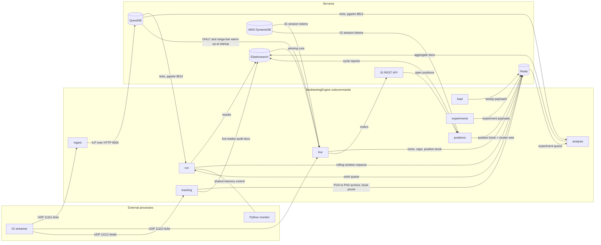
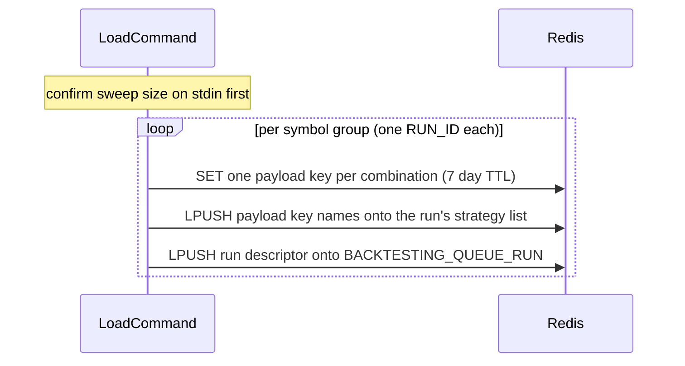
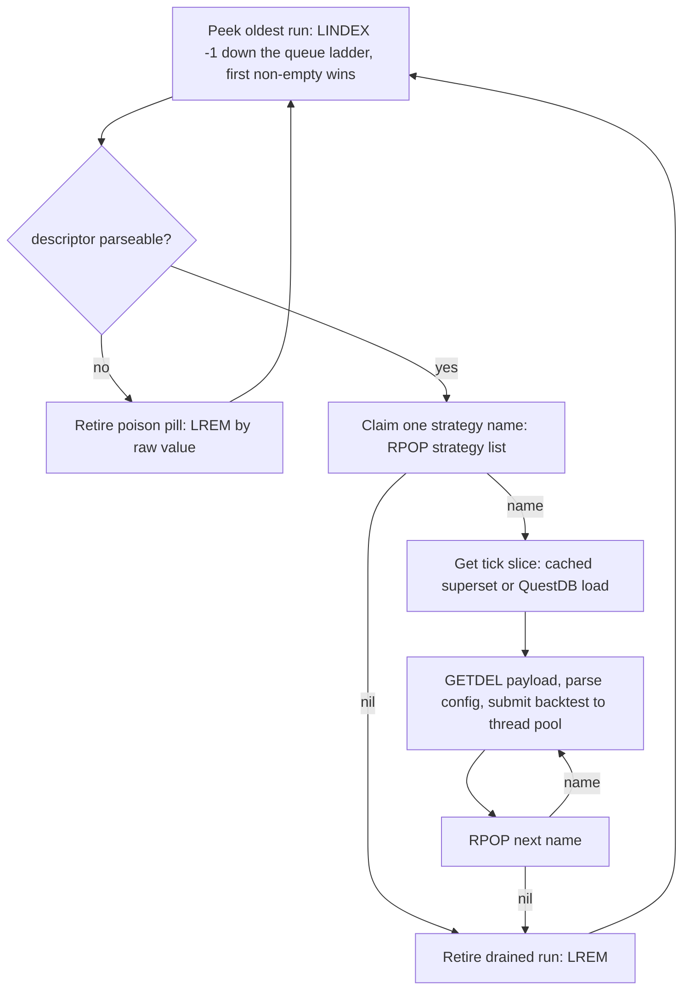
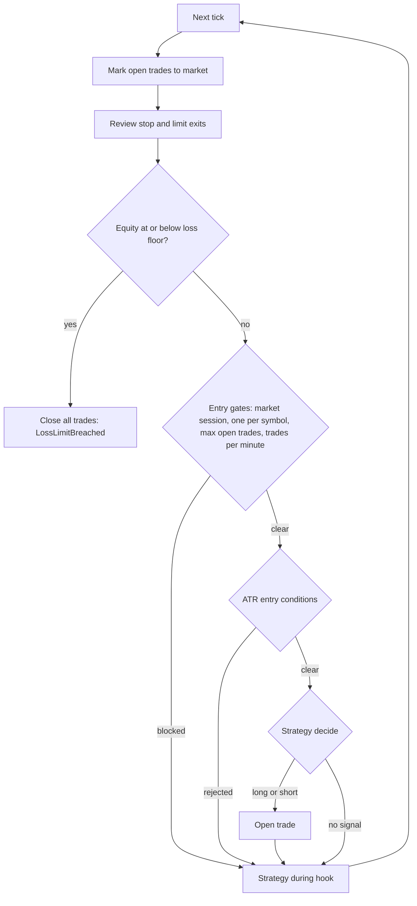
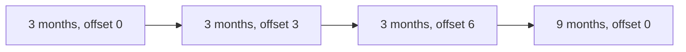
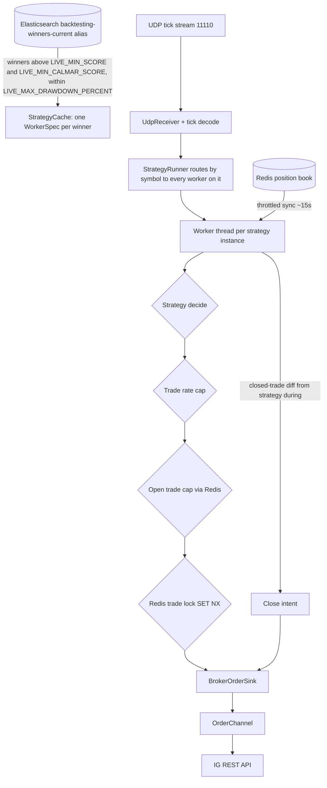
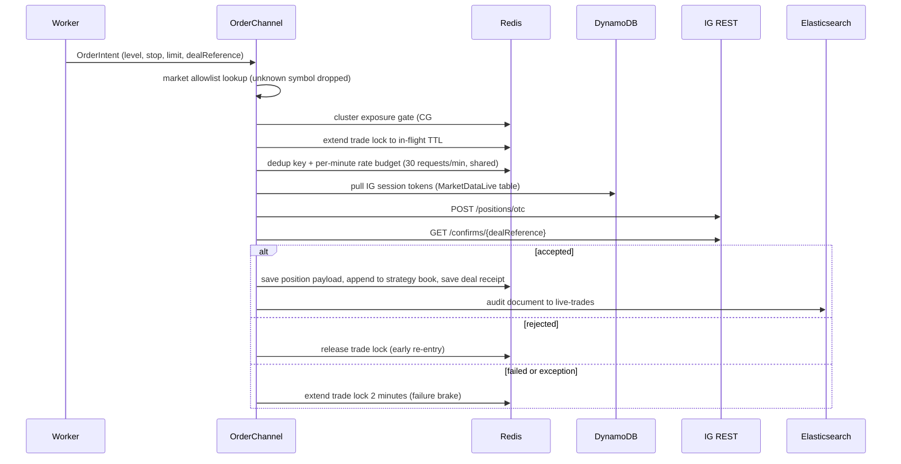
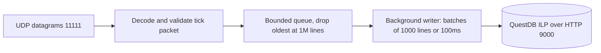
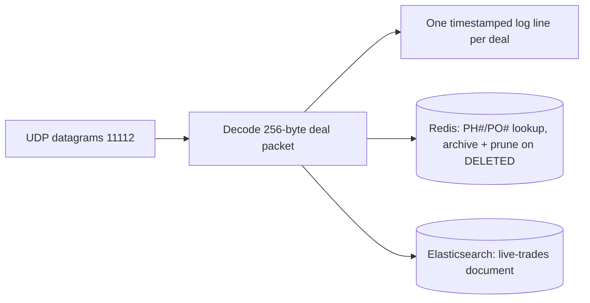
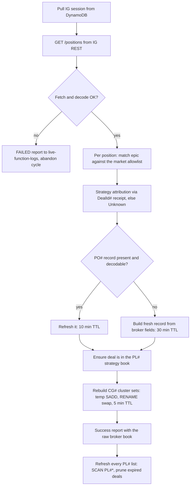

# Architecture

How the engine is put together and how data flows through it. Commands and usage are in [QUICKSTART.md](QUICKSTART.md); configuration in [ENVIRONMENT.md](ENVIRONMENT.md).

The binary (`source/main.cpp`) dispatches eight subcommands: `load`, `run`, `experiments`, `analysis`, `ingest`, `live`, `tracking`, and `positions`.

## System context

External to this repo: the IG streamer (an IG Lightstreamer client that publishes the tick feed on both tick ports and the account's deal updates on 11112), the IG login service (keeps session tokens fresh in DynamoDB), and the Python monitor/controller. The live position book and the `CG#` cluster membership sets are maintained in-engine by the `positions` subcommand ([Positions](#positions)) — the C++ replacement for the external C# position-producer cron.

## Source layout

| Directory | Contents |
| --- | --- |
| `source/main.cpp` | Subcommand router |
| `source/load/` | Sweep expansion and queueing: `loadCommand`, `runConfigurationBuilder`, one sweep-builder/factory pair per strategy under `config/` (`random`, `ohlcBreakout`, `fvg`, `keltnerFade`, `sessionRangeBreakout`, `squeezeBreakout`, `nyOpenRangeBreakout`, `liquiditySweepReversal`, `rangeVelocity`), `sweep/` (`parameterGenerator`, `parameterRange`, `sweepCombination`), `utility/symbolGroups` (symbol-group tokenising/validation behind the one-run-per-group contract), `redisLoader` |
| `source/run/` | Backtest worker: `runCommand`, `queue/` (`drainRuns` drain loop, `runQueue`/`redisRunner` queue primitives, `rollingWindow`), `backtestRunner`, `runnerBridge`/`tickCache` (cross-run tick superset cache), `operations`, `trading/` (`runLoop`, `tradeManager`, `reviewStopAndLimit`, `exitRules`), `reporting/` (`elasticPublisher`, `elasticClient` results-vs-winners routing, `outcomeIndices` weekly index/alias naming, `resultsSummary` performanceScore/calmarScore/maxDrawdownPercent, `tradingResults`, `tradeDocument`, `engineException`) |
| `source/experiments/` | Experiment producer: `experimentsCommand` (loadCommand's mirror for the experiment queue), one sweep-builder/factory pair per experiment under `config/` (`dipRecovery`) |
| `source/analysis/` | Experiment worker: `analysisCommand`, `analysisRunner`/`drainExperiments` (queue loop, drainRuns' mirror), `analysisBridge` (module-import seam), `experimentResults`/`experimentElastic` (aggregate-doc reporting) |
| `source/live/` | Live trading: `liveCommand`, `liveSettings`, `liveWinners`/`liveStrategyCache` (selection), `liveStrategyRunner` (workers), `brokerOrderSink`/`orderChannel`/`orderRequest` (order path), `redisTradeGate`/`redisPositionCounter`/`redisPositionFeed` (Redis seams), `broker/` (IG market calls), `monitoring/` (`liveReporter`, and `liveTrace` — structured live tracing to `live-traces`/`live-logs`, gated by `LIVE_TRACE_ENABLED`/`LIVE_LOG_SHIP_ENABLED`, imported by the order channel, sink, runner, `igRequests`, and `liveCommand`) |
| `source/ingest/` | UDP tick receiver → QuestDB ILP writer: `ingestCommand`, `questdbIngestClient` |
| `source/tracking/` | UDP deal receiver → per-deal enrichment: `trackingCommand`, `dealPacket` (256-byte deal wire format + decoder), `trackingReport` (the pure half: `PH#`/`PO#` lookup, close-pip calc, the `live-trades` document) |
| `source/positions/` | IG position producer: `positionsCommand` (minute loop, `--once` mode), `positionSync` (one sync cycle: `/positions` fetch + decode, `PO#`/`PL#` save/update, `CG#` cluster rebuild, `PL#` refresh, Elastic reports) |
| `source/strategies/` | `IStrategy` interface, `strategyFactory` (single factory + the `kActiveStrategies` live-eligibility list), the shared ATR entry gate (`conditions/entryConditions`), the shared time-cap exit (`timeCapExit`), `strategyErrors`, and the nine strategies: `randomStrategy`, `ohlcBreakout`, `fvg`, `keltnerFade`, `sessionRangeBreakout`, `squeezeBreakout`, `nyOpenRangeBreakout`, `liquiditySweepReversal`, `rangeVelocity` |
| `source/shared/` | Cross-cutting: `utilities/` (queue keys, base64, env, JSON, decimal JSON, OHLC builder + bar store, range-bar builder — the event-driven bar engine behind `rangeVelocity`, swing pivots — behind `liquiditySweepReversal`, EMA, ATR, symbol scale, market hours, logging, thread pool), `models/`, `net/` (UDP receiver, tick packet, `udpPorts` — the single source of truth for 11110/11111/11112), `questdb/`, `redis/` (client + trade locks, position manager, position clustering, API request gate), `ig/` (REST client), `aws/` (DynamoDB auth), `ipc/` (shared-memory control channel), `tradingDefinitions/` (config structs), `experiments/` (experiment model + the pure `chainMatcher`) |

## Backtest pipeline

### Queueing (`load`)

`load` expands a parameter sweep (combinations × symbol groups) and pushes one *run* per symbol group. Everything on the wire is base64-encoded JSON.

Order matters: payloads exist before their names are visible, and the strategy list is complete before the run is advertised — a worker that sees the run can immediately drain it.

| Redis key | Type | Contents |
| --- | --- | --- |
| `BACKTESTING_QUEUE_RUN` | list | Run descriptors (symbols, date window, risk limits) — head of the run-queue ladder; fresh sweeps and hand-queued one-offs land here |
| `BACKTESTING_QUEUE_RUN_CHAIN:1..3` | list | Run descriptors re-queued by the rolling-window ladder, one queue per rung (`rolling::queueKeyFor`) |
| `BACKTESTING_QUEUE_STRATEGY:<RUN_ID>` | list | Payload key names for that run |
| `BACKTESTING_QUEUE_STRATEGY_PAYLOAD:<RUN_ID>:<UUID>` | string | One strategy config, 7-day safety-net TTL |

### Draining (`run`)

The queue semantics are deliberate:

- **Runs live on a four-key strict-priority ladder.** `queue_keys::RUN_QUEUES` is `BACKTESTING_QUEUE_RUN` followed by `BACKTESTING_QUEUE_RUN_CHAIN:1..3` (one queue per rolling-window rung); the peek (`runQueue`'s `peekRunTail`) walks them in order and the first non-empty queue wins, so a fresh grid sweep always preempts the chained single-strategy backlog — and `LLEN` per key reads wave progress.
- **Run descriptors are shared adverts, not owned work items.** They are *peeked* (`LINDEX -1`), never popped, so any number of `run` processes can discover the same run and drain its strategy list in parallel. The strategy names are the exclusive work units — `RPOP` hands each to exactly one worker, and `GETDEL` consumes each payload exactly once.
- **Retirement is idempotent.** `LREM <queue> 0 <value>` removes the descriptor by value from the queue it was peeked from; when several workers converge on a drained run, the first `LREM` wins and the rest are no-ops. No distributed lock needed.
- **Crash safe.** A worker dying mid-run leaves the descriptor in place; the next peek re-discovers it. An unparseable descriptor is retired by its raw bytes without being parsed, so a poison pill can't wedge the queue.
- **Wasted work is bounded.** A worker claims its first strategy *before* any tick fetch, so losing the race on a nearly-drained run costs nothing.
- **Backtests pipeline across runs.** A run is retired as soon as its strategy list is drained — its backtests may still be executing while the worker moves on to the next run. The pool only quiesces immediately before a genuine QuestDB superset load (the cache's `beforeLoad` hook), not between runs.

The worker sizes its thread pool at 80% of hardware threads and exposes an `active_jobs` gauge / `stop_signal` flag to the Python monitor over a memory-mapped file (`/tmp/EngineControlShm`, 12-byte magic + gauge + stop flag — `source/shared/ipc/engineControl`).

### Tick superset cache

The rolling-window ladder makes every surviving strategy its own single-strategy run, so a naive worker would pay a full QuestDB load per window. Instead, `runnerBridge` keeps a per-process `TickCache` (`source/run/execution/tickCache.cppm`): one months-deep **superset** of ticks per symbol set, with the month boundaries computed by QuestDB itself in the same statement (a single `now()`, so data and boundaries can't disagree). Each `(LAST_MONTHS, OFFSET_MONTHS)` window is then a contiguous slice of the superset, found by binary search on the boundaries.

- Supersets are TTL'd and size-capped (`TICK_CACHE_TTL_MINUTES`, `TICK_CACHE_MAX_SUPERSETS` — see [ENVIRONMENT.md](ENVIRONMENT.md)); a window too deep for the resident superset falls back to an ad-hoc load without evicting it.
- Slices hold the superset alive via `shared_ptr`, so eviction can't pull the tick buffer out from under an in-flight backtest.
- The cache is single-threaded by design: only the drain loop touches it; pool threads only hold slice copies. Direct mode (`run <host> <base64-config>`) bypasses it entirely.

### Backtest execution

Per strategy, `Operations::run` builds a `TradeManager` and the strategy instance, then `trading::runTicks` drives the tick loop:

With `PEAK_HOURS_ONLY` in the run config (set for newly queued sweeps), entries are only taken during the symbol's peak sessions (`marketHours`, all UTC: Asia 00:00–06:00, three hours from the London open, three hours from the New York open; weekends and unknown symbols blocked, DST handled). Only entries are gated — exits, mark-to-market, and the strategy `during` hook always run.

The ATR entry gate (`source/strategies/conditions/entryConditions.cppm`, shared verbatim with `live`) sits after the caps and before `decide()`: the entry is skipped unless the ATR(10) gate series is warm and the current spread is at most 30% of the ATR; the strategy's ATR-multiple stop/limit distances are then converted to pips and clamped (stop 10–80, limit 3–300 pips).

Fills model the spread honestly — a LONG opens at the ask and exits on the bid (vice versa for SHORT), the spread is booked as an equity dip at open, and gap-through stops fill at the actual tick price. An optional slippage stress (`ENTRY_SLIPPAGE_TENTH_PIPS`, frozen into the run config at `load` time — see [ENVIRONMENT.md](ENVIRONMENT.md)) additionally worsens every entry fill by a fixed fraction of a pip against the trade, leaving the stop/limit anchors on the raw tick. Commission and overnight funding are not modeled — see [documents/technicalDebtAudit.md](documents/technicalDebtAudit.md) for the full realism notes.

### Rolling-window chaining

A run that completes its window automatically re-queues the same strategy config, same UUID, under a fresh RUN_ID for the next window — walking the strategy forward through history:

The 9-month rung is exported as `rolling::kFullHistory` — the terminal full-history run that `live` selects winners from; the shorter rungs are screening only.

"Completes" embeds a performance gate (`operations.cppm`): a finished run only counts as `Completed` when its performance score clears 5 on more than 5 decisive trades. A run that exhausts its ticks but misses the gate finishes as `Underperformed` — it neither chains nor reaches the results/winners indices, landing only in the final-record index (one lucky winner on a quiet window is a sample, not a strategy); a liquidated run stops the same way. The re-queued advert does not go back onto `BACKTESTING_QUEUE_RUN`: it lands on the next rung's own chain queue (`rolling::queueKeyFor` → `BACKTESTING_QUEUE_RUN_CHAIN:<rung>`), so fresh sweeps and earlier rungs always outrank the chained backlog.

### Results reporting

Results go to Elasticsearch (`elasticPublisher`, retry with backoff, NDJSON dead-letter file on exhaustion). Reporting documents are queued in memory and delivered by a background flusher thread in periodic `_bulk` batches (`ELASTIC_FLUSH_SECONDS`, default 30s; a final flush runs at process exit) — publishing never blocks a worker thread, and fast sweeps produce a handful of bulk requests instead of a per-run PUT storm:

The outcome indices are **weekly**: each `load` mints a batch label — `$BACKTEST_BATCH` or the current UTC ISO week, e.g. `2026-28` — stamps it into every run descriptor (`BATCH`/`EXECUTION_TS`, carried through Redis and every rolling-window rung), creates that week's indices, and atomically repoints the rolling `-current` aliases at them. One week's sweep therefore lands in its own index set while every earlier week stays untouched and searchable via the `backtesting-*` pattern, and outcome documents carry top-level `batch` + `executionTimestamp` fields. A config with an empty `BATCH` (pre-batch Redis payloads, hand-run configs) writes to the unsuffixed base names with no alias admin. The retired `trading_*` indices are a frozen archive — nothing writes to them anymore.

| Index (weekly, + `-current` alias) | Written when |
| --- | --- |
| `backtesting-final-YYYY-WW` | Every run (id `RUN_ID:UUID`) |
| `backtesting-results-YYYY-WW` | Completed runs on the screening rungs — carries `results.performanceScore` |
| `backtesting-winners-YYYY-WW` | Completed runs over the terminal full-history window (`rolling::kFullHistory`) — the population `live` selects from |
| `backtesting-failures-YYYY-WW` | Loss-limit cutoffs (if the run opts in) |
| `backtesting-trades` (static) | Every closed trade (opt-in via `ELASTIC_TRADES_ENABLED=1`) |
| `backtesting-experiments-YYYY-WW` | One aggregate doc per experiment × symbol group (written by `analysis`, index/alias prepared by `experiments` — not by `load`) |
| `engine_exceptions` (static) | Failures anywhere in the pipeline |
| `live-trades` (static) | Live order audit trail (written by `live` — the order channel via `igRequests` — and by `tracking`, one document per deal update; not `run`) |
| `live-traces` (static) | Structured live trace events (written by `live` via `liveTrace`, gated by `LIVE_TRACE_ENABLED`, default on) |
| `live-logs` (static) | Every log line, shipped through the `backtest_log` sink (gated by `LIVE_LOG_SHIP_ENABLED`, default on) |
| `live-function-logs` (static) | The `positions` producer's cycle reports, carrying the full IG `/positions` snapshot |

## Experiments

`experiments` / `analysis` ask **occurrence-rate questions** of the tick history — "price drops 1% over 10 minutes, then recovers 0.5% in a further 10 minutes: how often, and how far does it run?" — without writing a strategy. The pair reuses the backtest queue architecture wholesale (same `RedisLoader`, same peek/RPOP/GETDEL/LREM semantics, same batch/weekly-index doctrine) on its own key family, so the two pipelines never contend:

| Redis key | Type | Contents |
| --- | --- | --- |
| `BACKTESTING_QUEUE_EXPERIMENT_RUN` | list | Experiment run descriptors (symbols, tick window, batch) — a single queue: experiments never chain windows, so there is no `RUN_CHAIN` ladder here |
| `BACKTESTING_QUEUE_EXPERIMENT:<RUN_ID>` | list | Payload key names for that run |
| `BACKTESTING_QUEUE_EXPERIMENT_PAYLOAD:<RUN_ID>:<UUID>` | string | One experiment config, 7-day safety-net TTL |

An **experiment** is a chain of activities counted non-overlapping against the tick stream. Four primitives exist (`source/shared/experiments/experimentConfig.hpp`): `DirectionalMove` (signed percent within a window), `StaysInBand` (trailing range within a width), `NewExtreme` (strict new high/low vs a lookback), and `RangeRelativeMove` (a move sized in multiples of the trailing high–low range). The matcher (`source/shared/experiments/chainMatcher.cppm`) is pure and I/O-free: leg 1 is *rolling* (trailing-window extremes via monotonic deques with timestamp expiry — the `rangeBarBuilder` pattern adapted to time), later legs anchor at the previous leg's completion tick, and all per-tick arithmetic is int64. Band/lookback legs require gap-free tick *coverage*, so a weekend gap can never satisfy "stays in band". The full semantics (touch-within-window, expiry, serial attempts, documented undercounts) are stated in the module comment and pinned by `tests/chainMatcher.cpp`.

`analysis <questdb-host>` is `run`'s mirror for this queue: peek → claim-before-tick-load → one QuestDB load per run shared across the pool → one **aggregate document** per experiment × symbol group into the weekly `backtesting-experiments` index. Beyond raw occurrence counts, the doc carries what turning a pattern into a strategy needs: `attempts`/`failuresByLeg`/`completionRate` (P(chain | leg 1) — serial single-anchor, so conservative in clustered periods), month and hour-of-day occurrence buckets, per-symbol coverage, MFE/MAE excursion quantiles for completed and failed attempts separately, completion-time quantiles, and the mean spread at trigger — MFE p50 → limit distance, failed-attempt MAE p90 → stop distance, completion-time p90 → time cap.

Adding an experiment sweep: a factory/sweep pair under `source/experiments/config/`, one branch in `experimentsCommand.cppm`, tests in `tests/experimentSweep.cpp`. No worker or queue changes — the worker evaluates whatever chain arrives.

## Live trading

`live` turns the best backtest results into live IG positions. The broker owns positions and exits: the engine mirrors the position book *from* Redis (maintained by the `positions` subcommand — see [Positions](#positions)) and emits opens and closes — there is no local mark-to-market or stop/limit review.

Winner selection requires the run to have covered the ladder's terminal full-history window (`rolling::kFullHistory`) above `LIVE_MIN_SCORE`, with `results.maxDrawdownPercent` at or under `LIVE_MAX_DRAWDOWN_PERCENT` and `results.calmarScore` at or above `LIVE_MIN_CALMAR_SCORE` — the shorter rungs never qualify, and a spiky run cannot buy its way past the drawdown gate on expectancy. Winners are fetched per (active strategy, symbol) pair, and every winner becomes its own dedicated worker thread with its own tick queue — the receiver thread fans each tick out to every worker on its symbol, so N winning strategies on one symbol mean N workers each seeing the full stream. Workers whose winning config carries `PEAK_HOURS_ONLY` skip `decide()` outside the symbol's peak market sessions (`marketHours`); book sync and close handling never pause.

Every ENTRY gate fails closed: if Redis is unreachable the position count and lock checks block the entry rather than allowing it. The broker-request gate distinguishes the two order classes: **opens** fail closed on any Redis uncertainty and respect the shared 30/min soft budget, while **closes** are risk-reducing and fail *open* — Redis uncertainty and the soft budget never stop a close from reaching IG (an unsent close leaves live exposure, the one outcome worse than an extra request; only a definite duplicate marker paces it). The open-trade count is cached per worker for 15 seconds and invalidated the moment that worker's own open or close changes it.

A portfolio-level clustering gate (`source/shared/redis/positionClustering`) sits in the order channel, mirroring the C# engine's `CheckForCluster` and sharing its Redis wire contract: every symbol maps to one or more risk clusters, and an entry is blocked when any of its clusters is at capacity, already holds the same (symbol, strategy), or — for strict clusters — any deal from the same strategy. The `CG#<cluster>` membership sets are written only by the `positions` producer's minute sync; the gate reads them under a 10-second `CLUSTER_LOCK#` cooldown and, like the other gates, fails closed — an unmapped symbol or any Redis failure blocks the entry. The lock has a write side too: on the Accepted branch the order channel calls `PositionClustering::markOpened`, which unconditionally re-arms `CLUSTER_LOCK#` (plain `SET`, not `NX`) on every cluster of the symbol for 2 minutes — the new deal will not appear in `CG#` until the producer's next sync, and without the hold another strategy in the cluster could clear a capacity check against sets that predate it.

### Order placement

The open POST is never blind-retried (it is not idempotent — a lost ACK could double a position): it is sent exactly once, and a transport failure or gateway 5xx/408 is resolved by polling `GET /confirms/{dealReference}` under the reference the engine minted into the body. An open that cannot be confirmed maps to Failed and is not re-sent; the 2-minute failure TTL on the trade lock brakes re-entry while the `positions` sync reconciles anything that did land from the broker's own book.

Closes follow the same channel with their own dedup key (`API#close#<dealId>` — deliberately distinct from the open's key, so a fresh open's 30-second marker can never refuse the close that follows it): a blank-dealId guard and a 5-minute recent-close window suppress duplicates, then `POST /positions/otc` with `_method: DELETE`. A close the gate *refused* (never sent) maps to Failed and keeps the book entry, so the sync-driven retry loop re-fires it; a genuine transport failure after send maps to Gone and prunes the entry (the `positions` sync restores it from the broker book if it does still exist); on success the position payload is archived to history and pruned from the strategy book.

### Live Redis keys

| Key | Purpose |
| --- | --- |
| `LOCK#<uuid>#<LONG\|SHORT>` | Per-(strategy, direction) trade lock (`SET NX PX`, TTL `LIVE_TRADE_LOCK_SECONDS`) |
| `PL#<uuid>` | Strategy position book (list of open positions) |
| `PO#<dealRef>` | Position payload — booked under IG's echoed deal reference, not the deal id |
| `PH#<dealRef>` | Closed-position archive (60 days) |
| `DealId#<ref>#<symbol>` | Deal receipt (60 days) |
| `REQ#<minute>` | Per-minute IG API request budget (shared with the C# engine) |
| `API#<uuid><BUY\|SELL>` | Open-order dedup marker (30s) |
| `API#close#<dealId>` | Close-order dedup marker (30s) — its own namespace so an open's marker never blocks its close |
| `CG#<cluster>` | Cluster membership set (`symbol#strategy#dealReference`), rebuilt each minute by the `positions` producer (its only writer) — the clustering gate reads it |
| `CLUSTER_LOCK#<cluster>` | 10-second cluster cooldown try-lock (`SET NX PX`), left to expire after each check; re-armed for 2 minutes (plain `SET`, `markOpened`) on every accepted open of a symbol in the cluster |

## Ingest

Tick packets are a fixed 40-byte little-endian layout (`bid f64, ask f64, timestamp micros i64, symbol char[16]` — `source/shared/net/tickPacket.cppm`). Malformed, non-finite, out-of-range, or unknown-symbol ticks are dropped at decode. The written columns (`ask`, `bid`, `timestamp`, one table per symbol) are exactly what `run` reads back through `SqlManager`.

## Tracking

When the IG Lightstreamer feed pushes a `TRADE:*` account update, the external streamer serialises it as one fixed 256-byte little-endian **deal packet** — four doubles (`level`, `size`, `stopLevel`, `limitLevel`, each NaN when absent) followed by NUL-padded ASCII fields (`dealReference`, `dealId`, `dealIdOrigin`, `epic`, `direction` `BUY|SELL`, `status` `OPEN|UPDATED|DELETED`, `dealStatus` `ACCEPTED|REJECTED`, `currency`, `channel`, `expiry`, IG's raw `timestamp` string, `guaranteedStop`) — and fires it at UDP 11112. The full byte map lives in `source/tracking/dealPacket.cppm`, the C++ end of the same hand-rolled wire contract style as the tick feed.

`tracking` shares the ingest/live `UdpReceiver`, decodes each datagram, and logs the deal in full — deals are account-level events (a handful per day, not a tick stream). The only structural rule is the datagram length (anything not exactly 256 bytes is counted as dropped); field content passes through unjudged — unlike ticks there is no plausibility gate, because what a given status or absent level means is for the consumer to decide. The decode handler then enriches each deal (`trackingCommand`, with the pure half in `trackingReport`): it looks the deal up in Redis by its reference (`PH#` history first, `PO#` live book as fallback), computes close pips for a `DELETED` deal with a known position and a real close level, archives the book entry the moment the broker says `DELETED` (`PO#` → `PH#`, pruned from the `PL#` list — idempotent when the strategy-close path already moved it), and queues one audit document per deal to the `live-trades` Elasticsearch index.

## Positions

`positions` is the IG position **producer** — the in-process replacement for the external C# `igmarkets_positions` cron. Every minute (first cycle immediately; `--once` runs a single cycle and exits) it mirrors the broker's own `/positions` book into the Redis position store that `live` reads, keeping the broker the source of truth for what is actually open.

The doctrine is TTL-driven: `PO#` payloads deliberately carry a short TTL and live only as long as the producer keeps re-stamping them, so a deal the broker no longer reports simply expires and falls out of its `PL#` book on the refresh pass — nothing has to observe an explicit close event. Updates get 10 minutes and fresh saves 30 (a brand-new deal's receipt and book entries may lag a cycle); during Friday 21:55–21:59 UTC the update TTL stretches to 2 days + 2 hours, so positions still open at the IG weekly close survive Redis until Sunday-night trading resumes. Any fetch-stage failure — no DynamoDB session, HTTP failure, undecodable body — files a `FAILED-*` report to `live-function-logs` and abandons the whole cycle: the refresh pass never prunes against a book that could not be read (an unreadable book is not an empty one).

The `CG#` rebuild is the write-side counterpart of the clustering *gate* in the live order channel: the producer is the only writer (per non-empty cluster: SADD into a temp key, atomic `RENAME` over `CG#<cluster>` so stale members vanish with the swap, then a 5-minute TTL so a cluster whose deals all closed simply expires) and the gate only reads. Strategy attribution comes from the `DealId#<ref>#<symbol>` receipts the order channel writes at open — a deal opened outside the engine attributes to `Unknown`. Each cycle files a Success report to `live-function-logs` carrying the raw `/positions` body — the ground-truth account snapshot — after the `CG#` rebuild and before the closing `PL#` refresh pass.

Loop mechanics: no UDP receiver holds the main thread here, so the command loops directly — 1-second sleep ticks against a steady-clock deadline that is re-armed *after* each cycle completes (a slow IG exchange delays the next cycle rather than causing a catch-up burst), with SIGINT/SIGTERM honoured within about a second.

## Strategies

`IStrategy` (`source/strategies/strategy.cppm`) is two hooks: `decide(tick)` returns an optional entry direction, `during(tick, tradeManager)` runs every tick for bar-building and trade management. `strategies::makeStrategy(config)` is the single factory shared by backtest and live, so a `StrategyConfig` travels byte-identical (same UUID) from sweep → queue → backtest → rolling-window re-queue → Elasticsearch → live selection.

Nine strategies exist: `randomStrategy` (random entries — a testing/baseline harness, not a candidate edge), `ohlcBreakout` (multi-bar range breakout, EMA trend filter), `fvg` (fair-value-gap retracement with a higher-timeframe SMA trend filter), `keltnerFade` (mean reversion — fades stretches beyond a volatility band), `sessionRangeBreakout` (London open-range breakout of the Asian-session range), `squeezeBreakout` (volatility contraction/expansion — breaks of a single compressed bar, EMA trend filter), `nyOpenRangeBreakout` (opening-range breakout anchored to the New York open), `liquiditySweepReversal` (sweep of a prior swing pivot followed by a displacement reversal), and `rangeVelocity` (range-bar run velocity — momentum measured in event-driven range bars rather than time bars). Every strategy except `random` carries a time-cap exit (`timeCapExit`) alongside SL/TP. `scripts/load.sh` queues only seven of the nine by default: `random` is excluded (baseline harness) and `keltnerFade` was retired in 2026-28 — its sweep module remains, so load it explicitly to re-test.

Adding a strategy: one branch in `strategyFactory.cppm`, a sweep/factory pair under `source/load/config/`, a branch in the `load` command, and (for live eligibility) an entry in `kActiveStrategies` (also in `strategyFactory.cppm`).
