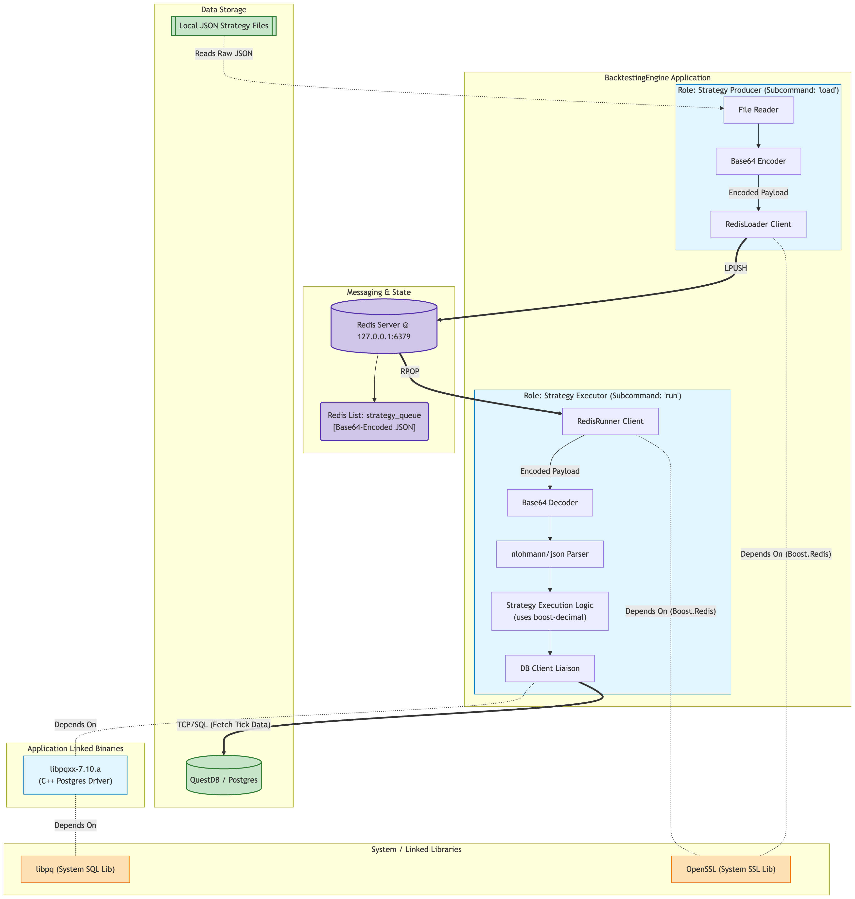

## C++ Backtesting Engine

Active development!

Feel free to explore, but this code base is usuable at the moment.

### About The Project

I'm developing a high-performance C++ backtesting engine designed to analyze financial data and evaluate multiple trading strategies at scale.

[](https://github.com/mccaffers/backtesting-engine-cpp/actions/workflows/build.yml) [](https://sonarcloud.io/summary/new_code?id=mccaffers_backtesting-engine-cpp) [](https://sonarcloud.io/summary/new_code?id=mccaffers_backtesting-engine-cpp) [](https://sonarcloud.io/summary/new_code?id=mccaffers_backtesting-engine-cpp)

I'm extracting results and creating various graphs for trend analyses using SciPy for calculations and Plotly for visualization.


*Read more results on https://mccaffers.com/quantitative_analysis/randomly_trading/*

## Setup

This backtesting engine can pull tick data from local files or from a Postgres database (I'm using QuestDB). Strategy execution is dispatched via a Redis list called `strategy_queue`, with each entry a Base64-encoded JSON payload, the `load` subcommand enqueues strategies (LPUSH) and the `run` subcommand dequeues and executes them (RPOP). The default workflow expects a local `redis-server` listening on `127.0.0.1:6379`.

### Clone with submodules

The project depends on two vendored libraries (`libpqxx` and `boost-decimal`) tracked as git submodules under `external/`. If you didn't clone with `--recurse-submodules`, run:

```
git submodule update --init --recursive
```

`scripts/build_dep.sh` does this for you on first run.

### Install libpq (required by libpqxx)

```
For Ubuntu/Debian systems: sudo apt-get install libpq-dev
On Red Hat Linux (RHEL) systems: yum install postgresql-devel
For Mac Homebrew: brew install postgresql
For OpenSuse: zypper in postgresql-devel
For ArchLinux: pacman -S postgresql-libs
```

### Install Boost, OpenSSL, and Redis

Boost.Redis is header-only but its single translation unit (compiled via `<boost/redis/src.hpp>` from `source/shared/redis/boostRedisImpl.cpp`) pulls in Boost.Asio's SSL layer, so OpenSSL is a transitive requirement. A local `redis-server` on `127.0.0.1:6379` is also needed for the default `load`/`run` workflow.

```
For Mac Homebrew: brew install boost openssl redis
For Ubuntu/Debian systems: sudo apt-get install libboost-all-dev libssl-dev redis-server
```

The canonical CI prerequisite list lives in `.github/workflows/scripts/brew.sh` (`postgresql`, `pkg-config`, `boost`).



### Build dependencies

`libpqxx` is built once via CMake. `boost-decimal` is header-only and pulled in via `add_subdirectory` from the top-level `CMakeLists.txt`, nothing to build. The script below handles the libpqxx build:

```
bash ./scripts/build_dep.sh
```

Xcode - Link Binary with Libraries (Source & Test)

```
./build/external/libpqxx/src/libpqxx-7.10.a
```

Xcode - Headers Path (for libpqxx and nlohmann/json)

``` 
"$(SRCROOT)/external/libpqxx/include/pqxx/internal"
"$(SRCROOT)/external/libpqxx/include/"
"$(SRCROOT)/external/"
```

Xcode - Library Path

```
"$(SRCROOT)/external/libpqxx/src"
"$(SRCROOT)/build/external/libpqxx/src"
"/opt/homebrew/Cellar/postgresql@14/14.15/lib/postgresql@14"
```

### Build the project

`bash ./scripts/build.sh`

### Environment variables

The engine reads its connection configuration from the environment. The following variables are **required** — `scripts/run.sh` validates them up front and aborts if any are missing or empty:

| Variable | Used for |
| --- | --- |
| `ELASTIC_HOST` | Elasticsearch base URL that trading results are PUT to (e.g. `https://elastic.example.com:9200`) |
| `ELASTIC_USER` | Elasticsearch HTTP basic-auth username |
| `ELASTIC_USER_PASSWORD` | Elasticsearch HTTP basic-auth password |
| `REDIS_HOST` | Redis host for the `strategy_queue` list |

I manage these secrets with [Infisical](https://infisical.com/), which injects them into the process environment at runtime, so I run the engine with:

```
infisical run -- sh ./scripts/run.sh
```

If you're not using Infisical, export the variables yourself (e.g. via your shell profile or a sourced `.env`) before invoking the script.

### Run via terminal

`bash ./scripts/run.sh` builds the project, then, if `redis-cli ping` reaches a local Redis, enqueues an inline JSON strategy via `load` and executes it via `run localhost`. If Redis is unreachable the script prints a message and exits cleanly (see `scripts/run.sh:22-25`), so first-time users without Redis still get a clear signal. The script requires the [environment variables](#environment-variables) listed above; with Infisical that becomes `infisical run -- sh ./scripts/run.sh`.

The `BacktestingEngine` binary exposes a subcommand CLI:

```
BacktestingEngine load
    Base64-encode a built-in strategy JSON (defined in
    source/load/loadCommand.cppm) and LPUSH it onto the Redis
    `strategy_queue` list.

BacktestingEngine run <questdb-host>
    RPOP one Base64-encoded strategy from `strategy_queue` and execute it
    against the supplied QuestDB host.

BacktestingEngine run <questdb-host> <base64-config>
    Decode the supplied Base64 strategy and execute it directly, bypassing
    Redis.
```

Defaults are `127.0.0.1:6379` for the Redis endpoint and `strategy_queue` for the list key (see `source/shared/redis/redisRunner.hpp` and `source/shared/redis/redisLoader.hpp`).

### Run tests via terminal

`bash ./scripts/test.sh`

### Contributing

This is an active solo experiment, so I'm not accepting pull requests right now, but please fork freely and use [GitHub Issues](https://github.com/mccaffers/backtesting-engine-cpp/issues) for bugs, questions, and ideas. See [CONTRIBUTING.md](CONTRIBUTING.md) for details.

### License
[MIT](https://choosealicense.com/licenses/mit/)
