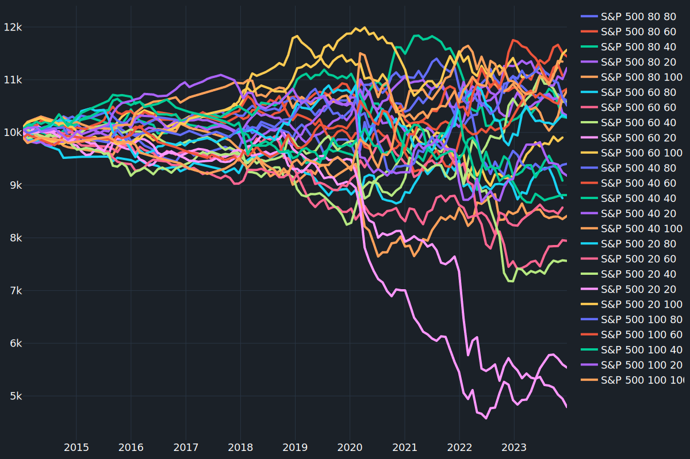

## C++ Backtesting Engine

### About The Project

This backtesting engine is a personal project to explore financial data with C++

[](https://github.com/mccaffers/backtesting-engine-cpp/actions/workflows/sonarcloud.yml)  [](https://sonarcloud.io/summary/new_code?id=mccaffers_backtesting-engine-cpp) [](https://sonarcloud.io/summary/new_code?id=mccaffers_backtesting-engine-cpp) [](https://sonarcloud.io/summary/new_code?id=mccaffers_backtesting-engine-cpp)

I'm extracting results and creating various graphs for trend analyses using SciPy for calculations and Plotly for visualization.



*Read more results on https://mccaffers.com/randomly_trading/*

### To use xcode
Requires google test to be installed


### How to use

`sh ./scripts/run.sh`

### How to use

`sh ./scripts/test.sh`

### Project Structure

```bash
project/
.
├── CMakeLists.txt
├── include
│   ├── Account.h
│   ├── CSVParser.h
│   ├── PriceRecord.h
│   ├── Strategies
│   │   └── SimpleMovingAverageStrategy.h
│   └── Strategy.h
├── readme.md
├── resources
├── run.sh
└── src
    ├── Account.cpp
    ├── FileManagement
    │   ├── CSVParser.cpp
    │   └── PriceRecord.cpp
    ├── Strategies
    │   └── SimpleMovingAverageStrategy.cpp
    └── program.cpp
```

### License
[MIT](https://choosealicense.com/licenses/mit/)
